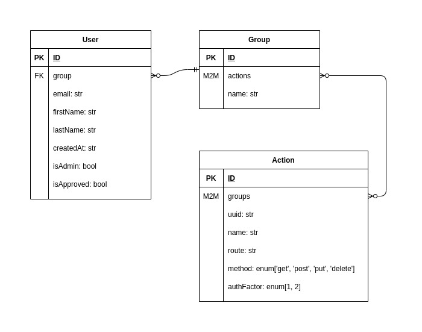
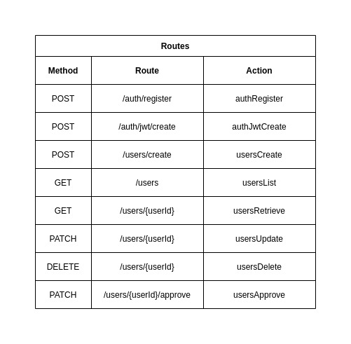

# Action Based Access Control [ABAC]

## Tech Stack
- Golang
- Docker

## Entities

## Routes

## Project Structure

### `/pkg` - The Framework
    - `/pkg/utils/`, `/pkg/config/`, ...
    - No dependencies on `/cmd`
    - Can be imported by external programs
### `/cmd` - The Programs
    - `/cmd/abac/`, `/cmd/service/`, ...
    - Domain specific logic stays close to the main() func

## Todo:
- [X] setup migrations
- [X] user model implementation
- [X] CRUD for user model
- [X] password keeping mech
- [X] field level validation
- [X] password hiding
- [X] check for required fields on each scheme
- [x] basic JWT auth
- [X] jwt support for all routes
- [X] refactor and restructure the whole project
- [X] refactoring teardown
- [X] server graceful shutdown
- [X] basic logging
- [ ] add auth middleware
- [ ] add request body validators
- [ ] customization of basic auth
