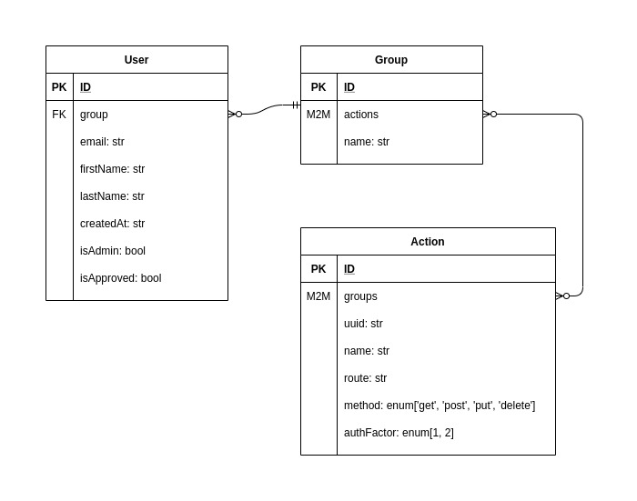
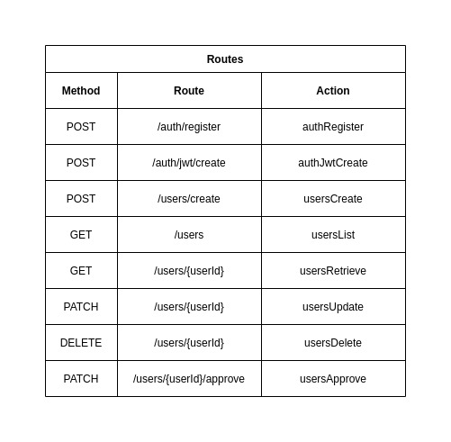

# Action Based Access Control [ABAC]

## Tech Stack
- Golang
- Docker

## Entities

## Routes

## Todo:
- [ ] user model implementation
- [ ] CRUD for user model
- [ ] basic JWT auth
- [ ] customization of basic auth
